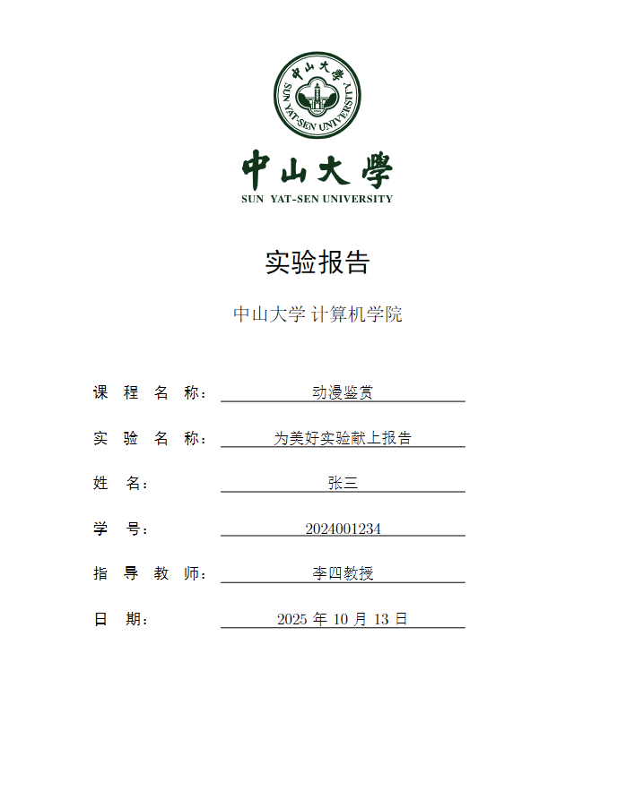
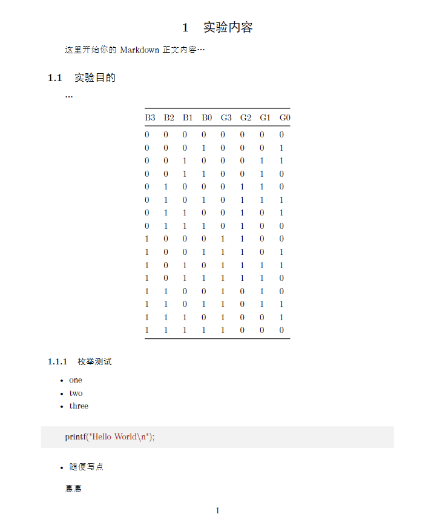

# AI跑了个实验报告模板怪好用的

markdwon -> latex -> pdf
同时兼容raw latex语法

# 依赖
- pandoc
- xelatex

# 编译命令
```bash
pandoc my_report.md -o my_report.pdf --pdf-engine=xelatex --template=my_template.latex
# pandoc my_report.md -o my_report.pdf --pdf-engine=xelatex --template=my_template.latex --lua-filter=image_placement.lua 目前还不太能用
```
# 效果图




# 图片脚本用法
现在还不太能用
```markdown
这是一些文本。

{placement=H width=75% #fig:important}

这是另一张图片，使用默认放置。
{#fig:normal}

还有一张图片，尝试放在页面顶部或底部。
{placement=tb}

```